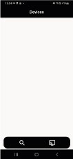

# blechem

This Bluetooth Low Energy (BLE) App is responsible of gathering data values from different arduino-based sensors.
At the moment the app is designed for it to communicate with 5 types of water-sensing sensors:
```
pH Sensor
EC Sensor
Pressure Sensor
Weight Sensor
Temperature Sensor
```
All this sensors can be connected at the same time and after finishing the experiment, be sent in .csv format to any e-mail address or saved in the internal mobile phone/tablet memory.

# App Usage Instructions
When the app is opened you see an empty screen where you can search new device by clicking in the magnifying glass icon.


